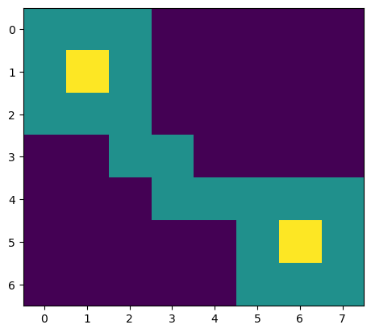
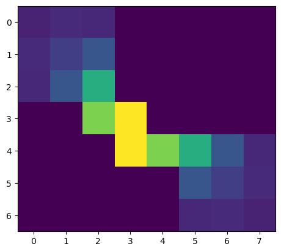

<h1 align='center'>JAXScape</h1>

-----

<!-- [](https://pypi.org/project/jaxscape)
[](https://pypi.org/project/jaxscape) -->

JAXScape is a minimal JAX library for connectivity analysis at scales. In the spirit of PyTorch, Equinox, BlackJAX or Flux, JAXScape aims to provide key utilities to build your own connectivity analysis workflow, including

- differentiable raster to graph and graph to raster mappings
- differentiable graph distance metrics
- moving window utilities

JAXScape leverages JAX's capabilities to accelerate distance computations on CPUs/GPUs/TPUs, while ensuring differentiability of all implemented classes and methods for awesome sensitivity analysis and optimization.


## Features 🚀
### Raster to graphs
- [x] `GridGraph` with differentiable adjacency matrix method
  - [x] edge assigned target pixel value
  - [ ] add option to calculate edge as weighted mean of source and target values 🏃‍♀️

### Distances
- Euclidean distance
  - [x] all-to-all calculation
  - [ ] all-to-few calculation
  - [ ] one-to-one calculation
- Randomized shortest path distance ([REF](https://arxiv.org/pdf/1212.1666))
  - [x] all-to-all calculation (distance matrix materialization)
  - [ ] all-to-few calculation 🏃‍♀️
    - Should be based on implementation in ResistanceDistance
  <!-- - see [ConScape](https://conscape.org/notebooks/nbk_landmarks.html) landmarks and
  - CircuitScape focal nodes https://docs.circuitscape.org/Circuitscape.jl/latest/usage/ -->
  - [ ] one-to-one calculation (no distance matrix materialization) 🏃‍♀️
- Resistance distance (see [CircuitScape.jl](https://github.com/Circuitscape/Circuitscape.jl/blob/master/src/core.jl) implementation)
  - [x] all-to-all calculation (distance matrix materialization)
  - [-] all-to-few calculation
    - Implementation still uses pseudo inverse
  - [ ] one-to-one calculation (no distance matrix materialization)
- Least-cost path (see https://github.com/srush/torch-queue/)

## Core
  - [x] Dense solvers (`jnp.linalg.solve` (using LU) or `pinv` (using SVD))
    - you may want to have a regularisation step, see https://github.com/Circuitscape/Circuitscape.jl/blob/fff12fe43e5af5be00f4056a87460ad07966e432/src/core.jl#L152
  - integration of lineax for choice of solver
    - This requires a benchmark of lineax solvers against simple `jnp.linalg.inv` currently used, see https://github.com/patrick-kidger/lineax/issues/115
  - [ ] Dense solver for undirected networks (Cholesky factorization)
  - Specialized direct solvers
    - [ ] UMFPACK (see implementation [here](https://github.com/arpastrana/jax_fdm/blob/main/src/jax_fdm/equilibrium/sparse.py) where scipy.spsolve is wrapped in JAX and vjp has been implemented - could also work with CHOLMOD) 🏃‍♀️ 
    - [ ] CHOLMOD
      - see https://docs.circuitscape.org/Circuitscape.jl/latest/ and https://github.com/Circuitscape/Circuitscape.jl/blob/fff12fe43e5af5be00f4056a87460ad07966e432/src/core.jl#L610-L616
      - and https://github.com/Circuitscape/Circuitscape.jl/blob/fff12fe43e5af5be00f4056a87460ad07966e432/src/core.jl#L487-L491
    - [ ] `jax.experimental.sparse.linalg.spsolve`
  - Indirect solvers
    - [ ] GMRES/CG with preconditioners for Krylov-based solvers
      - See [AlgebraicMultigrid.jl](https://github.com/JuliaLinearAlgebra/)  or [PyAMG](https://github.com/pyamg/pyamg)
      - You may exlcude this from differentiation! therefore you could directly rely on pyAMG
      - See lineax issues in https://github.com/patrick-kidger/lineax/issues/116

### Utilities
- [x] Moving window generator
  - Inspiration from Omniscape should be considered, see https://docs.circuitscape.org/Omniscape.jl/stable/
- [x] Sensitivity calculated with materialized distance matrix
- [ ] Sensitivity calculated without materialization of distance matrix
  - But this could not be possible, see https://github.com/patrick-kidger/lineax/issues/8#issuecomment-2218396564
  - https://github.com/patrick-kidger/lineax/issues/8#issuecomment-2218396564
    
- [ ] Differentiable connected component algorithm (see https://github.com/jax-ml/jax/issues/24737)
  - but an external call (pure_callback, see https://jax.readthedocs.io/en/latest/external-callbacks.html) to scipy/cusparse connected component libraries could do for our purposes (but not support of differentiation)
  - see https://github.com/dfm/extending-jax and take inspiration from https://github.com/arpastrana/jax_fdm/blob/main/src/jax_fdm/equilibrium/sparse.py 🏃‍♀️

### Benchmark
- [ ] scaling with number of nodes, CPU/GPU (python based)
- [ ] benchmark against CircuitScape and ConScape (Julia based)
- [ ] Moving window tests

## Installation

```console
pip install jaxscape
```

## Documentation

To build.
- Show utilization of different distance metrics
- Show influence of \theta for RSP metrics, similar to https://conscape.org/notebooks/nbk_getting_started.html
- Show optimization of \theta, see REF
- Show landscape priorization

## Quick example

Here we calculate the contribution of each pixel to the functional habitat connectivity of the landscape.

```python
import jax
import jax.numpy as jnp
from jaxscape.rsp_distance import RSPDistance
from jaxscape.gridgraph import GridGraph
import matplotlib.pyplot as plt

D = 1.0  # dispersal distance
theta = jnp.array(1.)
distance = RSPDistance(theta)

# Define a habitat suitability raster
habitat_suitability = jnp.array(
    [
        [1, 1, 1, 0, 0, 0, 0, 0],
        [1, 2, 1, 0, 0, 0, 0, 0],
        [1, 1, 1, 0, 0, 0, 0, 0],
        [0, 0, 1, 1, 0, 0, 0, 0],
        [0, 0, 0, 1, 1, 1, 1, 1],
        [0, 0, 0, 0, 0, 1, 2, 1],
        [0, 0, 0, 0, 0, 1, 1, 1],
    ],
    dtype="float32",
)
plt.imshow(habitat_suitability)
plt.show()
```
<div align="center"></div>


```python
activities = habitat_suitability > 0

# Equivalent connected habitat calculation.
# We first need to calculate a distance, 
# that we transform into an ecological proximity
def calculate_ech(habitat_quality):
    grid = GridGraph(activities=activities, vertex_weights=habitat_quality)
    dist = distance(grid)
    K = jnp.exp(-dist / D)
    q = grid.get_active_vertices_weights()
    ech = jnp.sqrt(q @ (K @ q)) 
    return ech

# derivative of w.r.t pixel habitat suitability 
# represents pixel contribution to landscape connectivity
grad_ech = jax.grad(calculate_ech)
sensitivities = grad_ech(habitat_suitability)

plt.imshow(sensitivities)
plt.show()
```
<div align="center"></div>


## License

`jaxscape` is distributed under the terms of the [MIT](https://spdx.org/licenses/MIT.html) license.


## Notes
- Rook contiguity will increase computational complexity