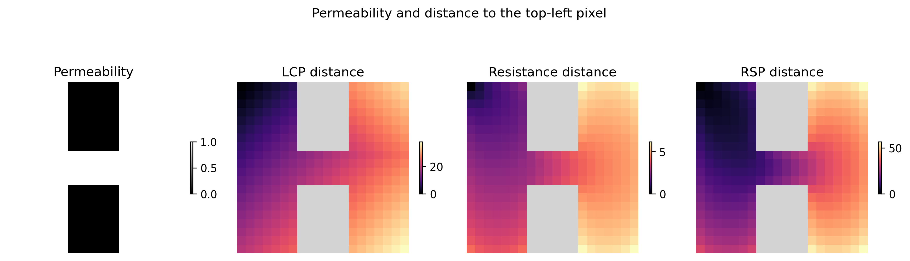

[](https://github.com/vboussange/jaxscape/actions/workflows/run_tests.yml)
[](https://doi.org/10.5281/zenodo.15267703)

<div align="center">
  
</div>
<!-- [](https://pypi.org/project/jaxscape)
[](https://pypi.org/project/jaxscape) -->

---

JAXScape is a minimal JAX library for connectivity analysis at scales. It provide key utilities to build your own connectivity analysis workflow, including

- differentiable and GPU-accelerated graph distance metrics
- differentiable raster to graph and graph to raster mappings
- moving window utilities for the implementations for large-scale connectivity analysis pipelines

JAXScape leverages JAX's capabilities to accelerate distance computations on CPUs/GPUs/TPUs, while ensuring differentiability of all implemented classes and methods for awesome sensitivity analysis and optimization.


## Installation

```console
uv add jaxscape
```

For GPU compatibility, install JAX following the [official JAX installation guide](https://jax.readthedocs.io/en/latest/installation.html). JAXScape will automatically use the JAX backend you have configured.

You may be required to install optional linear solvers for large-scale resistance distance computations (see the documentation page).

## Quick start

```python
import jax.numpy as jnp
from jaxscape import GridGraph
from jaxscape import LCPDistance, ResistanceDistance, RSPDistance
import numpy as np

# loading jax array representing permeability
permeability = jnp.array(np.loadtxt("permeability.csv", delimiter=","))
grid = GridGraph(grid=permeability)

# Calculating distances of all pixels to top left pixel
source = grid.coord_to_index(jnp.array([0]), jnp.array([0]))

distances = {
    "LCP distance": LCPDistance(),
    "Resistance distance": ResistanceDistance(solver = CholmodSolver()),
    "RSP distance": RSPDistance(theta=0.01, cost=lambda x: 1 / x)
}

fig, axs = plt.subplots(1, 3, figsize=(10, 4))
for ax, (title, distance) in zip(axs, distances.items()):
    dist_to_node = distance(grid, source)
    cbar = ax.imshow(grid.node_values_to_array(dist_to_node.ravel()), cmap="magma")
    ax.axis("off")
    ax.set_title(title)
    fig.colorbar(cbar, ax=ax, shrink=0.2)

fig.suptitle("Distance to top left pixel")
plt.tight_layout()
plt.show()
```
<div align="center"></div>

But what's really cool about `JAXscape` is that you can autodiff through thoses distances! Check out the [documentation](#documentation) to learn about applications and more!


## Documentation

Comprehensive documentation is available at [https://vboussange.github.io/jaxscape](https://vboussange.github.io/jaxscape/)

## Features and roadmap 🚀
See issues; most notably:

- [ ] Support for direct and iterative sparse solvers on GPU (cf [spineax](https://github.com/johnviljoen/spineax))
- [ ] Benchmark against `CircuitScape`, `ConScape.jl` and [`radish`](https://github.com/nspope/radish).

## License

`jaxscape` is distributed under the terms of the [MIT](https://spdx.org/licenses/MIT.html) license.

## Related packages
- gdistance
- ConScape
- Circuitscape
- graphhab
- conefor
- resistanceGA
- landscapemetrics
- radish

## Citation

If you use JAXScape in your research, please cite:

```bibtex
@software{jaxscape2024,
  author = {Boussange, Victor},
  title = {JAXScape: A minimal JAX library for connectivity modelling at scale},
  year = {2024},
  doi = {10.5281/zenodo.15267703},
  url = {https://github.com/vboussange/jaxscape}
}
```
