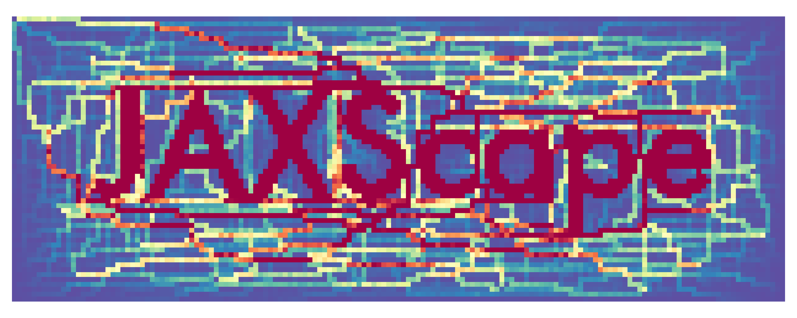
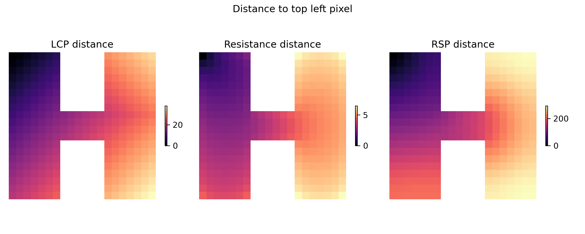
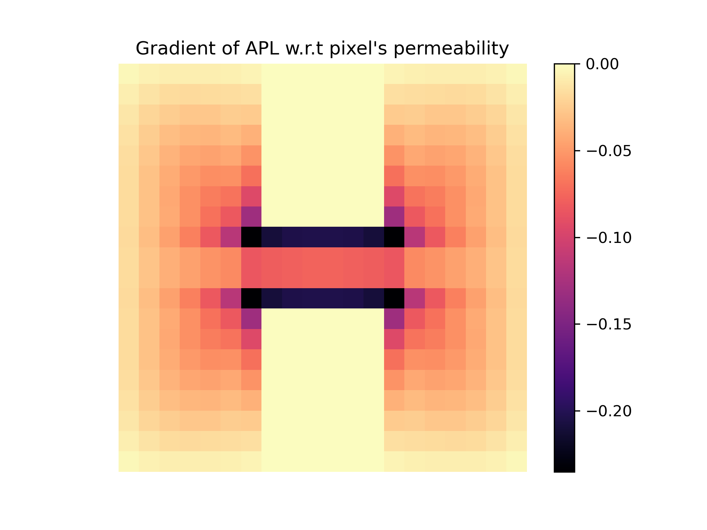

[](https://github.com/vboussange/jaxscape/actions/workflows/run_tests.yml)

<div align="center">
  
</div>
<!-- [](https://pypi.org/project/jaxscape)
[](https://pypi.org/project/jaxscape) -->

---

JAXScape is a minimal JAX library for connectivity analysis at scales. It provide key utilities to build your own connectivity analysis workflow, including

- differentiable raster to graph and graph to raster mappings
- differentiable graph distance metrics
- moving window utilities

JAXScape leverages JAX's capabilities to accelerate distance computations on CPUs/GPUs/TPUs, while ensuring differentiability of all implemented classes and methods for awesome sensitivity analysis and optimization.


## Installation

```console
pip install git+https://github.com/vboussange/jaxscape.git
```

## Quick start

Let's define our graph. 

```python
import jax.numpy as jnp
from jaxscape.gridgraph import GridGraph
import numpy as np

# loading jax array representing permeability
permeability = jnp.array(np.loadtxt("permeability.csv", delimiter=","))

# we discard pixels with permeability equal to 0
activities = permeability > 0
plt.imshow(permeability, cmap="gray")
plt.axis("off")

grid = GridGraph(activities=activities, vertex_weights=permeability)
```


Let's calculate some distances on the grid graph. We will specifically calculate and project the distance of all pixels to the top left pixel


```python
from jaxscape.resistance_distance import ResistanceDistance
from jaxscape.lcp_distance import LCPDistance
from jaxscape.rsp_distance import RSPDistance

# Calculating distances of all pixels to top left pixel
source = grid.coord_to_active_vertex_index([0], [0])

distances = {
    "LCP distance": LCPDistance(),
    "Resistance distance": ResistanceDistance(),
    "RSP distance": RSPDistance(theta=0.01, cost=lambda x: 1 / x)
}

fig, axs = plt.subplots(1, 3, figsize=(10, 4))
for ax, (title, distance) in zip(axs, distances.items()):
    dist_to_node = distance(grid, source)
    cbar = ax.imshow(grid.node_values_to_array(dist_to_node.ravel()), cmap="magma")
    ax.axis("off")
    ax.set_title(title)
    fig.colorbar(cbar, ax=ax, shrink=0.2)

fig.suptitle("Distance to top left pixel")
plt.tight_layout()
plt.show()
```
<div align="center"></div>

But what's really cool about jaxscape is that you can autodiff through thoses distances! Here we calculate the gradient of the average path length of the graph w.r.t pixel permeability

```python

# we need to provide the number of active vertices, for jit compilation
@eqx.filter_jit
def average_path_length(permeability, activities, nb_active, distance):
    grid = GridGraph(activities=activities, 
                     vertex_weights=permeability,
                     nb_active=nb_active)
    dist = distance(grid)
    return dist.sum() / nb_active**2

grad_connectivity = jax.grad(average_path_length)
nb_active = int(activities.sum())


distance = LCPDistance()
average_path_length(permeability, activities, nb_active, distance)


sensitivities = grad_connectivity(permeability, activities, nb_active, distance)
plt.figure()
cbar = plt.imshow(sensitivities, cmap = "magma")
plt.title("Gradient of APL w.r.t pixel's permeability")
plt.colorbar(cbar)
```
<div align="center"></div>

For a more advanced example with windowed sensitivity analysis and dispatch on multiple GPUs, see `benchmark/moving_window_*.py`


## Features and roadmap 🚀
### Raster to graphs
- [x] `GridGraph` with differentiable adjacency matrix method

### Distances
<!-- - Euclidean distance
  - [x] all-to-all calculation
  - [ ] all-to-few calculation
  - [ ] one-to-one calculation -->

- **Least-cost path**
  - [x] Bellman-Ford (one-to-all)
  - [x] Floyd-Warshall (all-to-all)
  - [ ] Differentiable Djikstra or A* (see implementation [here](https://github.com/srush/torch-queue/))

- **Resistance distance**
  - [x] all-to-all calculation with dense solver (`pinv`, resulting in full distance matrix materialization)
  - [-] advanced mode with direct solvers (laplacian factorization, cannot scale to large landscape)
    - Must rely on lineax, with wrapper over specialized solver for sparse systems:
      - UMFPACK and CHOLMOD (see implementation [here](https://github.com/arpastrana/jax_fdm/blob/main/src/jax_fdm/equilibrium/sparse.py) where scipy.spsolve is wrapped in JAX and vjp has been implemented - could also work with CHOLMOD) 🏃‍♀️ 
      - `jax.experimental.sparse.linalg.spsolve`
  - [ ] advanced mode with indirect solvers (no laplacian factorization, requires preconditioning)
      - GMRES/CG with preconditioners for Krylov-based solvers
      - Probably the best approach would be to use a wrapper around `pyamg` and `pyamgx`  (the former does not support batch mode, while the latter does), using `lineax` for adjoint definition and `pure_callback`
        - The `dlpack` JAX utility could be used to ensure that we have a zero-copy overhead between scipy sparse arrays or cuPy arrays
        - one could use `.aspreconditioner` together with `lineax.cg`, or use the full amg cycle
      - See [AlgebraicMultigrid.jl](https://github.com/JuliaLinearAlgebra/)  or [PyAMG](https://github.com/pyamg/pyamg)
      - See also [lineax issues](https://github.com/patrick-kidger/lineax/issues/116)
      - See also solvers used in JAX-FEM, [here](https://github.com/deepmodeling/jax-fem/blob/main/jax_fem/solver.py)
- **Randomized shortest path distance** ([REF](https://arxiv.org/pdf/1212.1666))
  - [x] all-to-all calculation (distance matrix materialization)
  - [-] all-to-few calculation
    - Should be based on direct or inderict solvers, similarly to ResistanceDistance
  <!-- - see [ConScape](https://conscape.org/notebooks/nbk_landmarks.html) landmarks and
  - CircuitScape focal nodes https://docs.circuitscape.org/Circuitscape.jl/latest/usage/ -->
  - [ ] one-to-one calculation

### Utilities
- [x] Moving window generator    
- [ ] Differentiable connected component algorithm (see [here](https://github.com/jax-ml/jax/issues/24737))
  - An external call to scipy/cusparse connected component libraries could do for our purposes (but not support of differentiation)
  - see [jax doc](https://github.com/dfm/extending-jax), [doc on pure callbacks](https://jax.readthedocs.io/en/latest/external-callbacks.html) a cool concrete example [here](https://github.com/arpastrana/jax_fdm/blob/main/src/jax_fdm/equilibrium/sparse.py)

### Benchmark
- [x] scaling with number of nodes, CPU/GPU
- [x] Moving window tests
- [ ] benchmark against CircuitScape and ConScape (Julia based)

<!-- ## Documentation

To build.
- Show utilization of different distance metrics
- Show influence of \theta for RSP metrics, similar to https://conscape.org/notebooks/nbk_getting_started.html
- Show optimization of \theta, see REF
- Show landscape priorization -->

## License

`jaxscape` is distributed under the terms of the [MIT](https://spdx.org/licenses/MIT.html) license.

## Related packages
- gdistance
- ConScape
- Circuitscape
- graphhab
- conefor