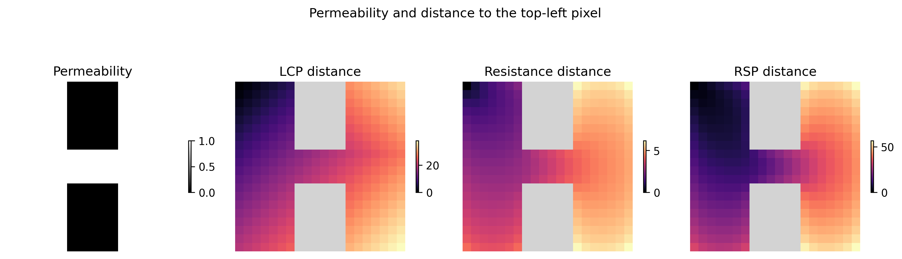
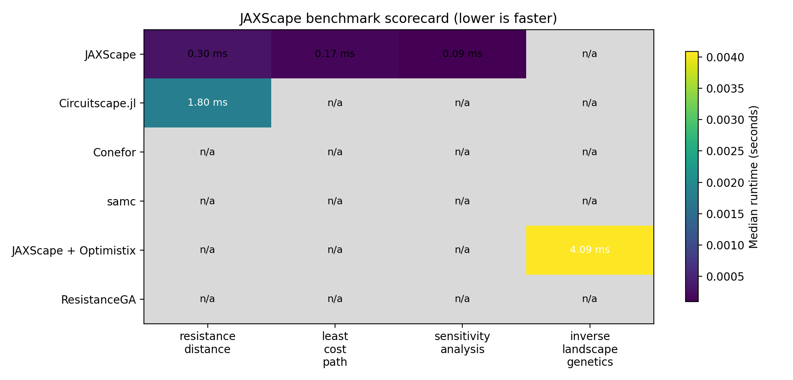

[](https://github.com/vboussange/jaxscape/actions/workflows/run_tests.yml)
[](https://github.com/vboussange/jaxscape/actions/workflows/build_docs.yml)
[](https://doi.org/10.5281/zenodo.15267703)

<div align="center">
  
</div>
<!-- [](https://pypi.org/project/jaxscape)
[](https://pypi.org/project/jaxscape) -->

---

JAXScape is a minimal JAX library for connectivity analysis at scales. It provide key utilities to build your own connectivity analysis workflow, including

- differentiable and GPU-accelerated graph distance metrics
- differentiable raster to graph and graph to raster mappings
- moving window utilities for implementing large-scale connectivity analysis pipelines

JAXScape leverages JAX's capabilities to accelerate distance computations on CPUs/GPUs/TPUs, while ensuring differentiability of all implemented classes and methods for awesome sensitivity analysis and optimization.


## Installation

```console
uv add jaxscape
```

For GPU compatibility, install JAX following the [official JAX installation guide](https://jax.readthedocs.io/en/latest/installation.html). JAXScape will automatically use the JAX backend you have configured.

You may be required to install optional linear solvers for large-scale resistance distance computations (see [the documentation page](https://vboussange.github.io/jaxscape/api/linear_solvers) for details).

## Quick start

**1. Download sample data**

```bash
curl -sL https://github.com/vboussange/jaxscape/releases/download/v0.0.6/data.zip -o data.zip && unzip -q data.zip && rm data.zip
```

**2. Run the analysis**

```python
import numpy as np
import matplotlib.pyplot as plt
import jax.numpy as jnp
from jaxscape import GridGraph
from jaxscape import LCPDistance, ResistanceDistance, RSPDistance

permeability = jnp.array(np.loadtxt("data/permeability.csv", delimiter=",")) + 0.001
barriers = np.asarray(permeability <= 0.1)

# Create a grid graph where edge weights are the average permeability of the two nodes
grid = GridGraph(grid=permeability, fun=lambda x, y: (x + y) / 2)

# We set the source to the top left pixel, and compute distances to all other pixels with three different distance metrics
source = grid.coord_to_index(jnp.array([0]), jnp.array([0]))

distances = {
    "LCP distance": LCPDistance(),
    "Resistance distance": ResistanceDistance(),
    "RSP distance": RSPDistance(theta=0.01, cost=lambda x: -jnp.log(x)),
}

distance_cmap = plt.cm.magma.copy()
distance_cmap.set_bad(color="lightgray")

fig, axs = plt.subplots(1, 4, figsize=(12, 4))

permeability_im = axs[0].imshow(permeability, cmap="gray", vmin=0, vmax=1)
axs[0].set_xticks([])
axs[0].set_yticks([])
for spine in axs[0].spines.values():
    spine.set_visible(True)
axs[0].set_title("Permeability")
fig.colorbar(permeability_im, ax=axs[0], shrink=0.2)

for ax, (title, distance) in zip(axs[1:], distances.items()):
    # Compute distances from all nodes to the source
    dist_to_node = distance(grid, source)

    # Convert from node values to a 2D array and hide barrier cells
    dist_array = np.asarray(grid.node_values_to_array(dist_to_node.ravel()))
    dist_array = np.ma.masked_where(barriers, dist_array)
    
    # Plotting
    im = ax.imshow(dist_array, cmap=distance_cmap)
    ax.axis("off")
    ax.set_title(title)
    fig.colorbar(im, ax=ax, shrink=0.2)

fig.suptitle("Permeability and distance to the top-left pixel")
plt.tight_layout()
plt.show()
```
<div align="center"></div>

But what's really cool about `JAXscape` is that you can autodiff through thoses distances! Check out the [documentation](#documentation) to learn about applications and more!


## Documentation

Comprehensive documentation is available at [https://vboussange.github.io/jaxscape](https://vboussange.github.io/jaxscape/)

## Benchmarking

<div align="center"></div>

## Features and roadmap 🚀
See issues; most notably:

- [ ] Support for direct and iterative linear sparse solvers on GPU (cf [spineax](https://github.com/johnviljoen/spineax))
- [ ] Benchmark against `CircuitScape`, `ConScape.jl` and [`radish`](https://github.com/nspope/radish).

## License

`jaxscape` is distributed under the terms of the [MIT](https://spdx.org/licenses/MIT.html) license.

## Related packages
- gdistance
- ConScape
- Circuitscape
- graphhab
- conefor
- resistanceGA
- landscapemetrics
- radish

## Citation

If you use JAXScape in your research, please cite:

```bibtex
@software{jaxscape2024,
  author = {Boussange, Victor},
  title = {JAXScape: A minimal JAX library for connectivity modelling at scale},
  year = {2025},
  doi = {10.5281/zenodo.15267703},
  url = {https://github.com/vboussange/jaxscape}
}
```
