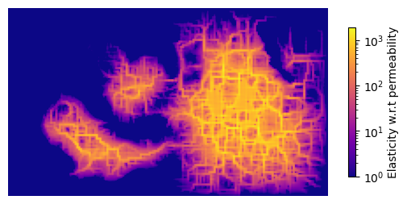

[](https://github.com/vboussange/jaxscape/actions/workflows/run_tests.yml)

<div align="center">
  
</div>
<!-- [](https://pypi.org/project/jaxscape)
[](https://pypi.org/project/jaxscape) -->

---

JAXScape is a minimal JAX library for connectivity analysis at scales. It provide key utilities to build your own connectivity analysis workflow, including

- differentiable raster to graph and graph to raster mappings
- differentiable graph distance metrics
- moving window utilities

JAXScape leverages JAX's capabilities to accelerate distance computations on CPUs/GPUs/TPUs, while ensuring differentiability of all implemented classes and methods for awesome sensitivity analysis and optimization.


## Installation

```console
pip install git+https://github.com/vboussange/jaxscape.git
```

## Quick start

Let's define our graph. 

```python
import jax.numpy as jnp
from jaxscape.gridgraph import GridGraph
import numpy as np

# loading jax array representing permeability
permeability = jnp.array(np.loadtxt("permeability.csv", delimiter=","))
plt.imshow(permeability, cmap="gray")
plt.axis("off")

grid = GridGraph(vertex_weights=permeability)
```


Let's calculate some distances on the grid graph. We will specifically calculate and project the distance of all pixels to the top left pixel


```python
from jaxscape.resistance_distance import ResistanceDistance
from jaxscape.lcp_distance import LCPDistance
from jaxscape.rsp_distance import RSPDistance

# Calculating distances of all pixels to top left pixel
source = grid.coord_to_index([0], [0])

distances = {
    "LCP distance": LCPDistance(),
    "Resistance distance": ResistanceDistance(),
    "RSP distance": RSPDistance(theta=0.01, cost=lambda x: 1 / x)
}

fig, axs = plt.subplots(1, 3, figsize=(10, 4))
for ax, (title, distance) in zip(axs, distances.items()):
    dist_to_node = distance(grid, source)
    cbar = ax.imshow(grid.node_values_to_array(dist_to_node.ravel()), cmap="magma")
    ax.axis("off")
    ax.set_title(title)
    fig.colorbar(cbar, ax=ax, shrink=0.2)

fig.suptitle("Distance to top left pixel")
plt.tight_layout()
plt.show()
```
<div align="center"></div>

But what's really cool about jaxscape is that you can autodiff through thoses distances! Here we calculate the gradient of the average path length of the graph w.r.t pixel permeability

```python

# we need to provide the number of active vertices, for jit compilation
@eqx.filter_jit
def average_path_length(permeability, distance):
    grid = GridGraph(permeability,)
    dist = distance(grid)
    return dist.sum() / nb_active**2

grad_connectivity = jax.grad(average_path_length)

distance = LCPDistance()
average_path_length(permeability, distance)


sensitivities = grad_connectivity(permeability, distance)
plt.figure()
cbar = plt.imshow(sensitivities, cmap = "magma")
plt.title("Gradient of APL w.r.t pixel's permeability")
plt.colorbar(cbar)
```
<div align="center"></div>

<!-- For a more advanced example with windowed sensitivity analysis and dispatch on multiple GPUs, see `benchmark/moving_window_*.py` -->


## Ecological connectivity analysis with `ConnectivityAnalysis` and `SensitivityAnalysis`

While you can use `WindowOperation` to leverage local window operations and build your own sensitivity analysis pipeline (see below), we provide `ConnectivityAnalysis` and `SensitivityAnalysis` to facilitate analyses of large graphs.

We'll play around with the following raster, which we will use to define the permeability and quality of our landscape:

```python
import rasterio
import jax.numpy as jnp
import matplotlib.pyplot as plt
from jaxscape import WindowOperation, padding

# loading a raster
with rasterio.open("../suitability.tif") as src:
    raster = src.read(1, masked=True) 
    quality = jnp.array(raster.filled(0), dtype="float32") 

plt.imshow(quality)
plt.axis("off")
```

<div align="center"></div>

To calculate the landscape connectivity, we need to define a disperal range for the species we consider, in terms of the maximum number of pixels an individual (or offspring) of this species can theoretically cross, should the permeability be 1 (highest).

```python
D = 20 # dispersal range in pixels
distance = LCPDistance() # fed to the function calculating the ecological proximity

def proximity(dist):
    return jnp.exp(-dist/D) # ecological proximity function
```

`ConnectivityAnalysis` calculates the connectivity of a landscape characterised by a `quality` and a `permeability` raster by returning the (quality-weighted) sum of ecological proximities (similarly to the [Harari index](https://mathworld.wolfram.com/HararyIndex.html) or the [Equivalent Connected Area](https://www.sciencedirect.com/science/article/pii/S0006320721000604)).

```python
from jaxscape import ConnectivityAnalysis
connectivity_prob = ConnectivityAnalysis(quality_raster=quality_raster,
                            permeability_raster=quality_raster, # assuming that quality and permeability 
                            distance=distance,
                            proximity=proximity,
                            coarsening_factor=0.,  # experimental feature to accelerate calculations, 0. means no coarsening
                            dependency_range=D,
                            batch_size=50 # number of pixels to process in parallel
                            )
connectivity = connectivity_prob.run(q_weighted=True) # scalar value
# Batch progress: 100%|██████████| 6/6 [00:06<00:00,  1.14s/it]
# Array(10223621., dtype=float32)
```

`SensitivityAnalysis` calculates the sensitivity (derivative) of the landscape connectivity, with respect to the `permeability` or `quality`.

```python
from jaxscape import SensitivityAnalysis
sensitivity_prob = SensitivityAnalysis(quality_raster=quality_raster,
                            permeability_raster=quality_raster,
                            distance=distance,
                            proximity=proximity,
                            coarsening_factor=0.,
                            dependency_range=D,
                            batch_size=20)

sensitivity_permeability = sensitivity_prob.run("permeability", q_weighted=True) # raster
# Batch progress: 100%|██████████| 36/36 [00:01<00:00, 24.16it/s]
```

This sensitivity is best displayed as an [elasticity](https://en.wikipedia.org/wiki/Elasticity_(economics)).

```python
elasticity = sensitivity_permeability * quality_raster
elasticity = jnp.nan_to_num(elasticity, nan=0.0)
plt.imshow(elasticity + 1e-2, 
           cmap="plasma", 
           norm=matplotlib.colors.LogNorm(vmin=1e0)
           )
plt.axis("off")
cbar = plt.colorbar(shrink=0.5)
cbar.set_label('Elasticity w.r.t permeability')
```

<div align="center"></div>

**❓ How can I use this for prioriation❓**
You want to prioritize pixels with high elasticity! Let's say that we have a certain budget to improve the permeability of the landscape, by incrasing each of the selected site by `improved_permeability = 0.4`. We compare two priorization scenarios: one where we select sites randomly, and one where we select sites based on their elasticity w.r.t permeability.


```python
threshold = jnp.percentile(elasticity, 95)  # Get the 99th percentile value excluding NaNs
high_sensitivity_coords = jnp.where(elasticity >= threshold)  # Get coordinates with high sensitivity
improved_quality_raster = quality_raster.at[high_sensitivity_coords].add(improved_permeability)

# Add 0.1 to 100 random cells of quality_raster
key = jr.PRNGKey(0)
random_indices = jr.choice(key, jnp.arange(elasticity.size), shape=(high_sensitivity_coords[0].size,), replace=False)
random_coords = jnp.unravel_index(random_indices, quality_raster.shape)
modified_quality_raster = quality_raster.at[random_coords].add(improved_permeability)

def run_connectivity_analysis(raster):
    connectivity_prob = ConnectivityAnalysis(quality_raster=quality_raster,
                            permeability_raster=raster,
                            distance=distance,
                            proximity=proximity,
                            coarsening_factor=0.,
                            dependency_range=D,
                            batch_size=50)
    return connectivity_prob.run(q_weighted=True)

base_connectivity = run_connectivity_analysis(quality_raster)
connectivity_improved = run_connectivity_analysis(improved_quality_raster)
connectivity_improved_randomly = run_connectivity_analysis(modified_quality_raster)

print("Landscape connectivity gain")
print(f"- based on priorization with elasticity: {(connectivity_improved - base_connectivity) / base_connectivity * 100:.2f}%")
print(f"- based on random priorization: {((connectivity_improved_randomly - base_connectivity) / base_connectivity * 100):.2f}%")
```

```
Landscape connectivity gain
- based on priorization with elasticity: 11.53%
- based on random priorization: 3.74%
```


## Building your own pipeline with `WindowOperation`

Let's iterate over moving windows! We can do so with the `eager_iterator` which will return a JAX tensory, or the `lazy_iterator`.

```python
buffer_size=10
window_size=50
quality_padded = padding(quality, buffer_size, window_size)

window_op = WindowOperation(shape=quality_padded.shape, 
                            window_size=window_size, 
                            buffer_size=buffer_size)

window_op.nb_steps # 8

# lazy iterator
fig, axs = plt.subplots(2, 4, figsize=(10, 5))
for i, (xy, w) in enumerate(window_op.lazy_iterator(quality_padded)):
    ax = axs.flatten()[i]
    ax.set_title(f"xy = {xy}")
    ax.imshow(w)
    ax.axis("off")
```
<div align="center"></div>

```python
# eager iterator
xy, windows = window_op.eager_iterator(quality)
xy.shape # (8, 2)
windows.shape # (8, 10+50+10, 10+50+10)
```

```python
new_window = jnp.ones_like(windows[2, ...])
new_raster = window_op.update_raster_with_focal_window(xy[2], quality_padded, new_window)

plt.figure()
plt.imshow(new_raster)
plt.axis("off")
```

## Features and roadmap 🚀
### Raster to graphs
- [x] `GridGraph` with differentiable adjacency matrix method

### Distances
<!-- - Euclidean distance
  - [x] all-to-all calculation
  - [ ] all-to-few calculation
  - [ ] one-to-one calculation -->

- **Least-cost path**
  - [x] Bellman-Ford (one-to-all)
  - [x] Floyd-Warshall (all-to-all)
  - [ ] Differentiable Djikstra or A* (see implementation [here](https://github.com/srush/torch-queue/))

- **Resistance distance**
  - [x] all-to-all calculation with dense solver (`pinv`, resulting in full distance matrix materialization)
  - [-] advanced mode with direct solvers (laplacian factorization, cannot scale to large landscape)
    - Must rely on lineax, with wrapper over specialized solver for sparse systems:
      - UMFPACK and CHOLMOD (see implementation [here](https://github.com/arpastrana/jax_fdm/blob/main/src/jax_fdm/equilibrium/sparse.py) where scipy.spsolve is wrapped in JAX and vjp has been implemented - could also work with CHOLMOD) 🏃‍♀️ 
      - `jax.experimental.sparse.linalg.spsolve`
  - [ ] advanced mode with indirect solvers (no laplacian factorization, requires preconditioning)
      - GMRES/CG with preconditioners for Krylov-based solvers
      - Probably the best approach would be to use a wrapper around `pyamg` and `pyamgx`  (the former does not support batch mode, while the latter does), using `lineax` for adjoint definition and `pure_callback`
        - The `dlpack` JAX utility could be used to ensure that we have a zero-copy overhead between scipy sparse arrays or cuPy arrays
        - one could use `.aspreconditioner` together with `lineax.cg`, or use the full amg cycle
      - See [AlgebraicMultigrid.jl](https://github.com/JuliaLinearAlgebra/)  or [PyAMG](https://github.com/pyamg/pyamg)
      - See also [lineax issues](https://github.com/patrick-kidger/lineax/issues/116)
      - See also solvers used in JAX-FEM, [here](https://github.com/deepmodeling/jax-fem/blob/main/jax_fem/solver.py)
- **Randomized shortest path distance** ([REF](https://arxiv.org/pdf/1212.1666))
  - [x] all-to-all calculation (distance matrix materialization)
  - [-] all-to-few calculation
    - Should be based on direct or inderict solvers, similarly to ResistanceDistance
  <!-- - see [ConScape](https://conscape.org/notebooks/nbk_landmarks.html) landmarks and
  - CircuitScape focal nodes https://docs.circuitscape.org/Circuitscape.jl/latest/usage/ -->
  - [ ] one-to-one calculation

### Utilities
- [x] Moving window generator    
- [ ] Differentiable connected component algorithm (see [here](https://github.com/jax-ml/jax/issues/24737))
  - An external call to scipy/cusparse connected component libraries could do for our purposes (but not support of differentiation)
  - see [jax doc](https://github.com/dfm/extending-jax), [doc on pure callbacks](https://jax.readthedocs.io/en/latest/external-callbacks.html) a cool concrete example [here](https://github.com/arpastrana/jax_fdm/blob/main/src/jax_fdm/equilibrium/sparse.py)

### Benchmark
- [x] scaling with number of nodes, CPU/GPU
- [x] Moving window tests
- [ ] benchmark against CircuitScape and ConScape (Julia based)

<!-- ## Documentation

To build.
- Show utilization of different distance metrics
- Show influence of \theta for RSP metrics, similar to https://conscape.org/notebooks/nbk_getting_started.html
- Show optimization of \theta, see REF
- Show landscape priorization -->

## License

`jaxscape` is distributed under the terms of the [MIT](https://spdx.org/licenses/MIT.html) license.

## Related packages
- gdistance
- ConScape
- Circuitscape
- graphhab
- conefor