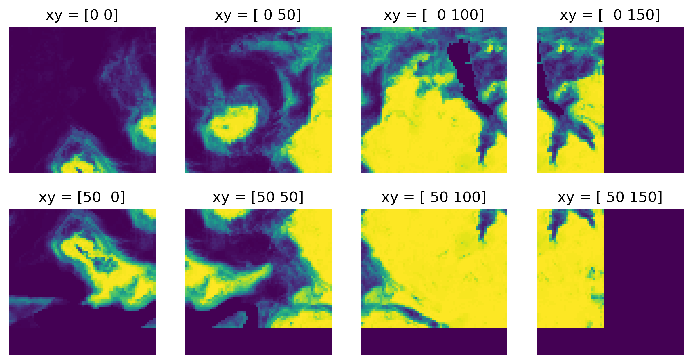

[](https://github.com/vboussange/jaxscape/actions/workflows/run_tests.yml)
[](https://doi.org/10.5281/zenodo.15267703)

<div align="center">
  
</div>
<!-- [](https://pypi.org/project/jaxscape)
[](https://pypi.org/project/jaxscape) -->

---

JAXScape is a minimal JAX library for connectivity analysis at scales. It provide key utilities to build your own connectivity analysis workflow, including

- differentiable raster to graph and graph to raster mappings
- differentiable graph distance metrics
- moving window utilities

JAXScape leverages JAX's capabilities to accelerate distance computations on CPUs/GPUs/TPUs, while ensuring differentiability of all implemented classes and methods for awesome sensitivity analysis and optimization.


## Installation

```console
uv add git+https://github.com/vboussange/jaxscape.git
```

## Quick start

Let's define our graph. 

```python
import jax.numpy as jnp
from jaxscape import GridGraph
import numpy as np

# loading jax array representing permeability
permeability = jnp.array(np.loadtxt("permeability.csv", delimiter=","))
plt.imshow(permeability, cmap="gray")
plt.axis("off")

grid = GridGraph(vertex_weights=permeability)
```


Let's calculate some distances on the grid graph. We will specifically calculate and project the distance of all pixels to the top left pixel


```python
from jaxscape import ResistanceDistance
from jaxscape import LCPDistance
from jaxscape import RSPDistance

# Calculating distances of all pixels to top left pixel
source = grid.coord_to_index(jnp.array([0]), jnp.array([0]))

distances = {
    "LCP distance": LCPDistance(),
    "Resistance distance": ResistanceDistance(),
    "RSP distance": RSPDistance(theta=0.01, cost=lambda x: 1 / x)
}

fig, axs = plt.subplots(1, 3, figsize=(10, 4))
for ax, (title, distance) in zip(axs, distances.items()):
    dist_to_node = distance(grid, source)
    cbar = ax.imshow(grid.node_values_to_array(dist_to_node.ravel()), cmap="magma")
    ax.axis("off")
    ax.set_title(title)
    fig.colorbar(cbar, ax=ax, shrink=0.2)

fig.suptitle("Distance to top left pixel")
plt.tight_layout()
plt.show()
```
<div align="center"></div>

But what's really cool about jaxscape is that you can autodiff through thoses distances! Here we calculate the gradient of the average path length of the graph w.r.t pixel permeability

```python

# we need to provide the number of active vertices, for jit compilation
@eqx.filter_jit
def average_path_length(permeability, distance):
    grid = GridGraph(permeability,)
    dist = distance(grid)
    return dist.sum() / nb_active**2

grad_connectivity = jax.grad(average_path_length)

distance = LCPDistance()
average_path_length(permeability, distance)


sensitivities = grad_connectivity(permeability, distance)
plt.figure()
cbar = plt.imshow(sensitivities, cmap = "magma")
plt.title("Gradient of APL w.r.t pixel's permeability")
plt.colorbar(cbar)
```
<div align="center"></div>

<!-- For a more advanced example with windowed sensitivity analysis and dispatch on multiple GPUs, see `benchmark/moving_window_*.py` -->


## Ecological connectivity analysis with `ConnectivityAnalysis` and `SensitivityAnalysis`

While you can use `WindowOperation` to leverage local window operations and build your own sensitivity analysis pipeline (see below), we provide `ConnectivityAnalysis` and `SensitivityAnalysis` to facilitate analyses of large graphs.

We'll play around with the following raster, which we will use to define the permeability and quality of our landscape:

<details>
<summary>Click to see the code</summary>

```python
import rasterio
import jax.numpy as jnp
import matplotlib.pyplot as plt
from jaxscape import WindowOperation, padding

# loading a raster
with rasterio.open("../suitability.tif") as src:
    raster = src.read(1, masked=True) 
    quality = jnp.array(raster.filled(0), dtype="float32") 

plt.imshow(quality)
plt.axis("off")
```
</details>

<div align="center"></div>

To calculate the landscape connectivity, we need to define a disperal range for the species we consider, in terms of the maximum number of pixels an individual (or offspring) of this species can theoretically cross, should the permeability be 1 (highest).

```python
D = 20 # dispersal range in pixels
distance = ResistanceDistance(solver=CholmodSolver()) # fed to the function calculating the ecological proximity

def proximity(dist):
    return jnp.exp(-dist/D) # ecological proximity function
```

`ConnectivityAnalysis` calculates the connectivity of a landscape characterised by a `quality` and a `permeability` raster by returning the (quality-weighted) sum of ecological proximities (similarly to the [Harari index](https://mathworld.wolfram.com/HararyIndex.html) or the [Equivalent Connected Area](https://www.sciencedirect.com/science/article/pii/S0006320721000604)).

```python
from jaxscape import ConnectivityAnalysis
connectivity_prob = ConnectivityAnalysis(quality_raster=quality_raster,
                            permeability_raster=quality_raster, # assuming that quality and permeability 
                            distance=distance,
                            proximity=proximity,
                            coarsening_factor=0.,  # experimental feature to accelerate calculations, 0. means no coarsening
                            dependency_range=D,
                            batch_size=50 # number of pixels to process in parallel
                            )
connectivity = connectivity_prob.run(q_weighted=True) # scalar value
# Batch progress: 100%|██████████| 6/6 [00:06<00:00,  1.14s/it]
# Array(10223621., dtype=float32)
```

`SensitivityAnalysis` calculates the sensitivity (derivative) of the landscape connectivity, with respect to the `permeability` or `quality`.

```python
from jaxscape import SensitivityAnalysis
sensitivity_prob = SensitivityAnalysis(quality_raster=quality_raster,
                            permeability_raster=quality_raster,
                            distance=distance,
                            proximity=proximity,
                            coarsening_factor=0.,
                            dependency_range=D,
                            batch_size=20)

sensitivity_permeability = sensitivity_prob.run("permeability", q_weighted=True) # raster
# Batch progress: 100%|██████████| 36/36 [00:01<00:00, 24.16it/s]
```

This sensitivity is best displayed as an [elasticity](https://en.wikipedia.org/wiki/Elasticity_(economics)).

```python
elasticity = sensitivity_permeability * quality_raster
elasticity = jnp.nan_to_num(elasticity, nan=0.0)
plt.imshow(elasticity + 1e-2, 
           cmap="plasma", 
           norm=matplotlib.colors.LogNorm(vmin=1e0)
           )
plt.axis("off")
cbar = plt.colorbar(shrink=0.5)
cbar.set_label('Elasticity w.r.t permeability')
```

<div align="center"></div>

**❓ How can I use this for priorization**

You want to prioritize pixels with high elasticity! Let's say that we have a certain budget to improve the permeability of the landscape, by incrasing each of the selected site by `improved_permeability = 0.4`. We compare two priorization scenarios: one where we select sites randomly, and one where we select sites based on their elasticity w.r.t permeability.

<details>
<summary>Click to see the code</summary>

```python
threshold = jnp.percentile(elasticity, 95)  # Get the 99th percentile value excluding NaNs
high_sensitivity_coords = jnp.where(elasticity >= threshold)  # Get coordinates with high sensitivity
improved_quality_raster = quality_raster.at[high_sensitivity_coords].add(improved_permeability)

# Add 0.1 to 100 random cells of quality_raster
key = jr.PRNGKey(0)
random_indices = jr.choice(key, jnp.arange(elasticity.size), shape=(high_sensitivity_coords[0].size,), replace=False)
random_coords = jnp.unravel_index(random_indices, quality_raster.shape)
modified_quality_raster = quality_raster.at[random_coords].add(improved_permeability)

def run_connectivity_analysis(raster):
  connectivity_prob = ConnectivityAnalysis(quality_raster=quality_raster,
              permeability_raster=raster,
              distance=distance,
              proximity=proximity,
              coarsening_factor=0.,
              dependency_range=D,
              batch_size=50)
  return connectivity_prob.run(q_weighted=True)

base_connectivity = run_connectivity_analysis(quality_raster)
connectivity_improved = run_connectivity_analysis(improved_quality_raster)
connectivity_improved_randomly = run_connectivity_analysis(modified_quality_raster)

print("Landscape connectivity gain")
print(f"- based on priorization with elasticity: {(connectivity_improved - base_connectivity) / base_connectivity * 100:.2f}%")
print(f"- based on random priorization: {((connectivity_improved_randomly - base_connectivity) / base_connectivity * 100):.2f}%")
```
</details>

```
Landscape connectivity gain
- based on priorization with elasticity: 11.53%
- based on random priorization: 3.74%
```

## Inverse problem
Suppose you have measured genetic distances between populations across a landscape and want to understand how landscape features have shaped genetic differentiation by influencing gene flow. This is an inverse problem—a type of reverse engineering where we infer the landscape permeability for that species, that could have led to the observed genetic patterns.

<div align="center"></div>

JAXScape allows us to solve this problem efficiently. To illustrate, we will walk through a simple example where we assume a known permeability matrix and attempt to recover it using a single genetic distance measurement between two populations.


### Loading the land cover raster
We begin by loading a land cover raster.

<details>
<summary>Click to see the code</summary>

```python
import rasterio

with rasterio.open("landcover.tif") as src:
  # We resample the raster to a smaller size to speed up the computation
  raster = src.read(1, masked=True, out_shape=(150, 150), resampling=rasterio.enums.Resampling.mode)  # Read the first band with masking
  lc_raster = jnp.array(raster.filled(0))   # Replace no data values with 0
```
</details>

### Generating the synthetic genetic distance
Next, we assign permeability values to each land cover category and compute the synthetic genetic distance between two populations. We assimilate the genetic distance between the two populations as the least cost path distance associated to the permeability matrix between the two locations.

<details>
<summary>Click to see the code</summary>

```python
category_to_distance_dict = {
    11: 2e-1,  # Water
    21: 2e-1,  # Developed, open space
    22: 3e-1,  # Developed, low intensity
    23: 1e-1,  # Developed, medium intensity (missing)
    24: 1e-1,  # Developed, high intensity (missing)
    31: 5e-1,  # Barren land
    41: 1.,  # Deciduous forest
    42: 1.,  # Evergreen forest
    43: 1.,  # Mixed forest
    52: 5e-1,  # Shrub/scrub
    71: 9e-1,  # Grassland/herbaceous
    81: 4e-1,  # Pasture/hay
    82: 4e-1,  # Cultivated crops
    90: 9e-1,  # Woody wetlands
    95: 6e-1  # Emergent herbaceous wetlands
}
permeability_raster = jnp.array(np.vectorize(reclass_dict.get)(lc_raster))
ref_grid = GridGraph(lc_raster)
source = ref_grid.coord_to_index(jnp.array([2]), jnp.array([2]))
target = ref_grid.coord_to_index(jnp.array([99]), jnp.array([99]))

distance = LCPDistance()
grid = GridGraph(permeability_raster)
start_time = time.time()
source_to_target_dist = distance(grid, source)[1,target]
print(f"Time taken for distance calculation: {time.time() - start_time:.2f} seconds")
print(f"Genetic distance between populations: {source_to_target_dist[0]:.2f}")
```
</details>

```
print(f"Time taken for distance calculation: {time.time() - start_time:.2f} seconds")
print(f"Genetic distance between populations: {source_to_target_dist[0]:.2f}")
```

### Neural network model
To infer permeability from land cover data, we define a simple neural network model that maps land cover categories to permeability values. While this example uses a basic architecture, it can be extended to incorporate additional environmental features.

Since land cover types are categorical, we use one-hot encoding and a single-layer neural network.


```python
import optax
from flax import nnx
from jax.nn import one_hot

category_to_index = {cat: i for i, cat in enumerate(reclass_dict.keys())}  # Map to indices

# Replace categories in lc_raster with indices
indexed_raster = jnp.array(np.vectorize(category_to_index.get)(lc_raster))


class Model(nnx.Module):
  def __init__(self, num_categories, rngs: nnx.Rngs):
    self.num_categories = num_categories
    self.linear = nnx.Linear(num_categories, 1, rngs=rngs)

  def __call__(self, x):
    x = self.linear(one_hot(x, num_classes=self.num_categories))
    x = jnp.clip(x, 1e-2, 1e0)
    return x
```

### Training our model

With our model defined, we can now train it to minimize the difference between the predicted and observed genetic distances.

```python
model = Model(len(category_to_index.keys()), rngs=nnx.Rngs(0)) 
optimizer = nnx.Optimizer(model, optax.adamw(5e-2)) 

x = indexed_raster.ravel()
@nnx.jit
def train_step(model, optimizer):
  def loss_fn(model):
    permeability = model(indexed_raster).ravel()
    permeability = ref_grid.node_values_to_array(permeability)
    grid = GridGraph(permeability)
    dist_to_node_hat = distance(grid, source).ravel()[target]
    return ((dist_to_node_hat - source_to_target_dist) ** 2).mean()

  loss, grads = nnx.value_and_grad(loss_fn)(model)
  optimizer.update(grads)
  return loss


train_steps = 100
for step in range(train_steps):
  l = train_step(model, optimizer)
  if step % 10 == 0:
    print(f"Step {step}, loss: {l}")
```

After training, we compare our inferred permeability values with the ground truth. As training progresses, the model should recover the expected permeability matrix.

<div align="center"></div>
With more training steps and a more complex model, results can be further improved. This simplified example demonstrates the core methodology, and scaling it up to incorporate additional environmental variables or multiple populations is straightforward!

## Building your own pipeline with `WindowOperation`

Let's iterate over moving windows! We can do so with the `eager_iterator` which will return a JAX tensory, or the `lazy_iterator`.

```python
buffer_size=10
window_size=50
quality_padded = padding(quality, buffer_size, window_size)

window_op = WindowOperation(shape=quality_padded.shape, 
                            window_size=window_size, 
                            buffer_size=buffer_size)

window_op.nb_steps # 8

# lazy iterator
fig, axs = plt.subplots(2, 4, figsize=(10, 5))
for i, (xy, w) in enumerate(window_op.lazy_iterator(quality_padded)):
    ax = axs.flatten()[i]
    ax.set_title(f"xy = {xy}")
    ax.imshow(w)
    ax.axis("off")
```
<div align="center"></div>

```python
# eager iterator
xy, windows = window_op.eager_iterator(quality)
xy.shape # (8, 2)
windows.shape # (8, 10+50+10, 10+50+10)
```

```python
new_window = jnp.ones_like(windows[2, ...])
new_raster = window_op.update_raster_with_focal_window(xy[2], quality_padded, new_window)

plt.figure()
plt.imshow(new_raster)
plt.axis("off")
```

## Features and roadmap 🚀
- [ ] Support for direct sparse solvers on GPU (currently only CPU supported)
- [ ] Support for iterative sparse solvers on GPU, possibly with `(py)amgx`
- [ ] Benchmark against `CircuitScape` and `ConScape`

## License

`jaxscape` is distributed under the terms of the [MIT](https://spdx.org/licenses/MIT.html) license.

## Related packages
- gdistance
- ConScape
- Circuitscape
- graphhab
- conefor
