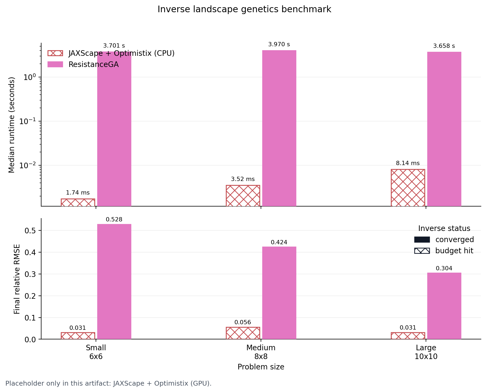

# Benchmark

JAXScape ships with a benchmark workspace whose published artifact is generated
by the same local CLI, keeps Julia and R dependencies under `benchmark/`,
records the thread configuration used for Python, Julia, and R, and emits both
CPU and GPU series for GPU-capable JAXScape methods.

## Compatibility summary

| Feature | Automated profiles | Optional local profiles | Notes |
| --- | --- | --- | --- |
| Resistance distance | `JAXScape / pinv / f32 (CPU/GPU)`, `JAXScape / pinv / f64 (CPU/GPU)`, `JAXScape / approx pinv / f32 (CPU/GPU)`, `JAXScape / approx pinv / f64 (CPU/GPU)`, `JAXScape / PyAMG`, `gdistance / commuteDistance`, `Circuitscape.jl / cg+amg`, `Circuitscape.jl / cholmod` | `JAXScape / AMJaxCGSolver / f32 (CPU/GPU)`, `JAXScape / AMJaxCGSolver / f64 (CPU/GPU)`, `JAXScape / approx AMJaxCGSolver / f32 (CPU/GPU)`, `JAXScape / approx AMJaxCGSolver / f64 (CPU/GPU)`, `JAXScape / CholmodSolver`, `JAXScape / approx CholmodSolver`, `Conefor` adapters | The published `gdistance` series is rescaled from commute time to effective resistance by dividing by graph volume. |
| Least-cost path | `JAXScape (CPU/GPU)`, `gdistance / costDistance` | `Conefor` adapter | Conefor remains a manual external integration and is omitted from the automated scorecard. |
| Sensitivity analysis | `JAXScape / shortest-path gradient (CPU/GPU)`, `gdistance / shortestPath`, `JAXScape / resistance gradient (CPU/GPU)`, `gdistance / passage` | none | The chart compares gradients of scalar least-cost and resistance-distance functionals to the matching `gdistance` path-incidence and passage-centrality surfaces. |
| Inverse landscape genetics | `JAXScape + Optimistix (CPU/GPU)`, `ResistanceGA` | none | The optimisation budget is fixed and reported for both toolchains. |

## Fairness policy

All automated runs use deterministic synthetic landscapes on 4-neighbour grid graphs and report the median of three repeats per case. Resistance, least-cost, and centrality tasks share the same raster-to-graph parameterization: if the raster entry at cell $i$ is the local cost $c_i$, then each undirected edge uses resistance $r_{ij} = \frac{c_i + c_j}{2}$ and conductance $w_{ij} = 1 / r_{ij}$. Sampled sites are placed one cell inside the boundary so every backend sees the same interior source-target set.

Thread counts are fixed across the participating runtimes with `BENCHMARK_THREADS`, which is propagated to `OMP_NUM_THREADS`, `OPENBLAS_NUM_THREADS`, `MKL_NUM_THREADS`, `VECLIB_MAXIMUM_THREADS`, `NUMEXPR_NUM_THREADS`, `JULIA_NUM_THREADS`, `RCPP_PARALLEL_NUM_THREADS`, and `RCPPTHREAD_NUM_THREADS`. The recorded artifact also stores the exact `XLA_FLAGS` used for CPU runs. The published CI benchmark uses `BENCHMARK_THREADS=4`, and the local wrapper defaults to the same value. Packages that expose thread controls therefore run under the same four-thread budget; packages whose relevant routines are internally single-threaded still inherit the same environment and report that configuration in the artifact.

## Size tiers

| Feature | Small | Medium | Large |
| --- | --- | --- | --- |
| Resistance distance | `12 x 12`, 7 sampled nodes | `18 x 18`, 7 sampled nodes | `24 x 24`, 7 sampled nodes |
| Least-cost path | `16 x 16`, 7 sampled nodes | `24 x 24`, 7 sampled nodes | `32 x 32`, 7 sampled nodes |
| Sensitivity analysis | `6 x 6`, 5 sampled sites | `8 x 8`, 5 sampled sites | `10 x 10`, 5 sampled sites |
| Inverse landscape genetics | `6 x 6`, 5 sampled sites | `8 x 8`, 5 sampled sites | `10 x 10`, 5 sampled sites |

## Resistance distance

Formal problem: given an undirected grid graph $G = (V, E)$ with conductance weights $w_{ij}$ and a sampled node set $S \subset V$, compute the pairwise effective resistance matrix $R_{uv}$ for all $u, v \in S$.

Synthetic setup: each benchmark raster is a deterministic cost or resistance field generated from a seeded random base plus a smooth barrier. Adjacent cells define an edge resistance $r_{ij} = \frac{c_i + c_j}{2}$ and a conductance $w_{ij} = 1 / r_{ij}$. The benchmark samples four interior near-corner sites, the center, and two interior offset sites.

Software entry points:

- JAXScape dense baselines: `ResistanceDistance()(GridGraph(...), nodes=nodes)` and `ResistanceDistance(method=SpielmanApproximation(...))`, each benchmarked in both float32 and float64.
- JAXScape sparse variants: `ResistanceDistance(solver=PyAMGSolver())`, `ResistanceDistance(solver=CholmodSolver())`, `ResistanceDistance(solver=CholmodSolver(), method=SpielmanApproximation(...))`, and `ResistanceDistance(solver=AMJaxCGSolver(...))` in both exact and `SpielmanApproximation(...)` modes, with state from `distance.init(grid)`.
- `gdistance`: `gdistance::commuteDistance(...)` via `benchmark/external/gdistance_runner.R`, evaluated pairwise and then divided by the graph volume to report effective resistance instead of commute time.
- Circuitscape.jl: `Circuitscape.compute(config_path)` via `benchmark/external/circuitscape_resistance.jl`, with INI solver values `cg+amg` and `cholmod`.

Fairness notes: the automated cross-tool comparison uses CPU execution for every profile. Additional GPU series are emitted for the GPU-capable JAXScape paths, including the prepared AMJaxCG solve, while the current sparse Python Cholmod/PyAMG adapters and Julia adapters remain CPU-only in this workspace.

<div align="center"></div>

## Least-cost path

Formal problem: given the same grid graph and sampled node set $S$, compute the pairwise shortest-path distance matrix $D_{uv}$ for all $u, v \in S$ under edge costs $r_{ij} = \frac{c_i + c_j}{2}$.

Synthetic setup: the raster generator and sample-node pattern are the same as for resistance distance, but the grid sizes are larger because the all-pairs least-cost problem is materially cheaper for the supported JAX implementation than the dense resistance baseline.

Software entry points:

- JAXScape: `LCPDistance()(GridGraph(...), nodes=nodes)`.
- `gdistance`: `gdistance::costDistance(...)` via `benchmark/external/gdistance_runner.R` on the same 4-neighbour transition graph.
- Optional local adapter: the unpublished Conefor hook remains available through `benchmark/external/conefor_runner.sh`, but is not part of the automated scorecard.

<div align="center"></div>

## Sensitivity analysis

Formal problem: evaluate the derivative of a scalar connectivity functional with respect to raster entries, but only for objectives that have a matching centrality or passage interpretation in the comparison package.

The benchmark therefore uses two single-origin objectives on the shared cost surface. Let $s$ be the first sampled site and $T$ the remaining sampled destinations.

For least-cost path sensitivity, the scalar loss is

$$
L_{\mathrm{sp}}(c) = \sum_{t \in T} d_{\mathrm{sp}}(s, t; c),
$$

where $d_{\mathrm{sp}}$ is the shortest-path distance under edge costs $r_{ij} = \frac{c_i + c_j}{2}$. Away from path ties, $\partial L_{\mathrm{sp}} / \partial r_e$ is exactly the total shortest-path incidence of edge $e$ across the sampled destinations. Rasterizing and summing `gdistance::shortestPath(...)` over the same destination set therefore yields the matching third-party centrality surface.

For resistance sensitivity, the scalar loss is the corresponding commute-time functional,

$$
L_{\mathrm{rw}}(c) = \operatorname{vol}(G(c)) \sum_{t \in T} R_{\mathrm{eff}}(s, t; c),
$$

where $R_{\mathrm{eff}}$ is effective resistance and $\operatorname{vol}(G)$ is the graph volume. Because commute time satisfies $C_{st} = \operatorname{vol}(G) R_{\mathrm{eff}}(s, t)$, the derivative of $L_{\mathrm{rw}}$ with respect to edge resistance is the expected traversal count through that edge under the corresponding random walk. Summing `gdistance::passage(..., theta = 0, totalNet = "total")` over the same destination set therefore yields the matching third-party passage-centrality surface.

Synthetic setup: the benchmark uses deterministic rasters at three sizes and the same five interior sampled sites for every backend. The scorecard shows both runtime and the cosine similarity between the JAX gradient surface and its `gdistance` reference surface.

Software entry points:

- JAXScape shortest-path gradient: `eqx.filter_grad(run_shortest_path_centrality_problem)` over `LCPDistance()(GridGraph(...), nodes=sample_nodes)`.
- `gdistance` shortest-path centrality: repeated `gdistance::shortestPath(..., output = "SpatialLines")`, rasterized and summed in `benchmark/external/gdistance_runner.R`.
- JAXScape resistance gradient: `eqx.filter_grad(run_resistance_centrality_problem)` over `benchmark_graph_volume(cost_raster) * ResistanceDistance()(GridGraph(...), nodes=sample_nodes)`.
- `gdistance` resistance centrality: repeated `gdistance::passage(..., theta = 0, totalNet = "total")`, summed in `benchmark/external/gdistance_runner.R`.

<div align="center"></div>

## Inverse landscape genetics

Formal problem: infer a raster-valued resistance or permeability field parameter $\theta$ by minimizing a discrepancy between observed pairwise dissimilarities $y$ and model-predicted pairwise distances $f_\theta(S)$. The benchmark reports both runtime and the final relative RMSE,

$$
\mathrm{relative\;RMSE} = \frac{\sqrt{\frac{1}{n}\sum_i (f_\theta(S)_i - y_i)^2}}{\sqrt{\frac{1}{n}\sum_i y_i^2}}.
$$

Synthetic setup: for each raster size, the benchmark first generates a deterministic raster and a fixed set of sample sites, then derives the target pairwise response from that same synthetic landscape. The optimisation task is therefore a controlled regression problem rather than an empirical data-fitting exercise.

Software entry points:

- JAXScape: `optx.minimise(...)` with `optx.LBFGS`, minimizing the mean-squared error between `ResistanceDistance()(GridGraph(sigmoid(logits) + 1e-3), nodes=sample_coords)` and the synthetic target matrix.
- ResistanceGA: `ResistanceGA::SS_optim(...)` with inputs from `ResistanceGA::gdist.prep(...)`, and the response vector generated by `ResistanceGA::Run_gdistance(...)`.

Parametric model details:

- JAXScape parameterization: the free variable is an unconstrained raster of logits. The benchmark maps logits to permeability with `sigmoid(logits) + 1e-3`, so every cell remains strictly positive.
- ResistanceGA parameterization: the raster is treated as a continuous resistance surface and optimized with `GA.prep(..., method = "LL", select.trans = list("M"), max.cont = 25, pop.size = 12, maxiter = 3, run = 1, parallel = BENCHMARK_THREADS)`. `select.trans = list("M")` restricts the search to the monomolecular transformation family documented by `Resistance.tran`, rather than the full transformation catalog.

Fairness notes: both optimisation paths are intentionally budget-limited. The chart marks converged inverse runs with filled markers and iteration-budget hits with hollow markers, so runtime and fit quality can be read together.

<div align="center"></div>

## Regenerate locally

```bash
uv sync --extra benchmark
./benchmark/install_external_tools.sh
./benchmark/run_benchmarks.sh --device cpu --require-complete
```

The wrapper defaults to `BENCHMARK_THREADS=4`. Override that variable explicitly only when you want a different published thread budget.

For local GPU profiling, keep the same workflow and switch the device hint:

```bash
./benchmark/run_benchmarks.sh --device gpu
```

To include the optional direct JAXScape solver locally, install the extra once:

```bash
uv sync --extra benchmark --extra cholespy
```

The full-suite entry point keeps the cross-software orchestration in
`benchmark/benchmark_distances.py` and delegates JAXScape internals to task
modules under `benchmark/jaxscape/`. Those task modules are imported by the
orchestrator, and each keeps a lightweight no-argument `main()` for standalone
JAXScape-only runs.

```bash
uv run --extra benchmark python benchmark/jaxscape/resistance_distance.py
```

Resistance solver variants are registered in `JAXSCAPE_RESISTANCE_PROFILES` in
`benchmark/jaxscape/resistance_distance.py`; adding a new JAXScape solver should
usually be a new profile entry plus its solver factory. Benchmark entry points
set `XLA_PYTHON_CLIENT_PREALLOCATE=false` by default unless it is already set,
so the coordinator does not grab most GPU memory before the worker
subprocesses start.
