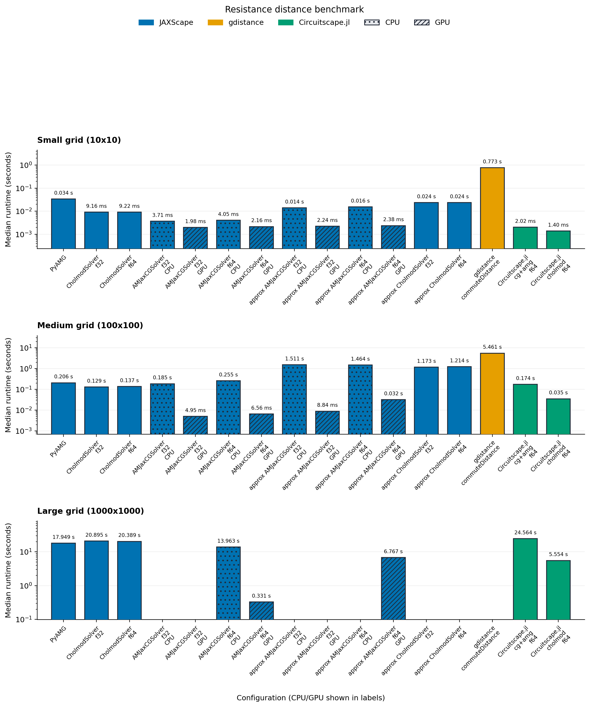
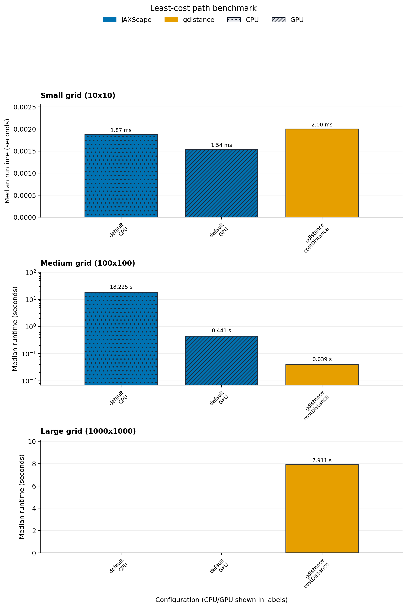
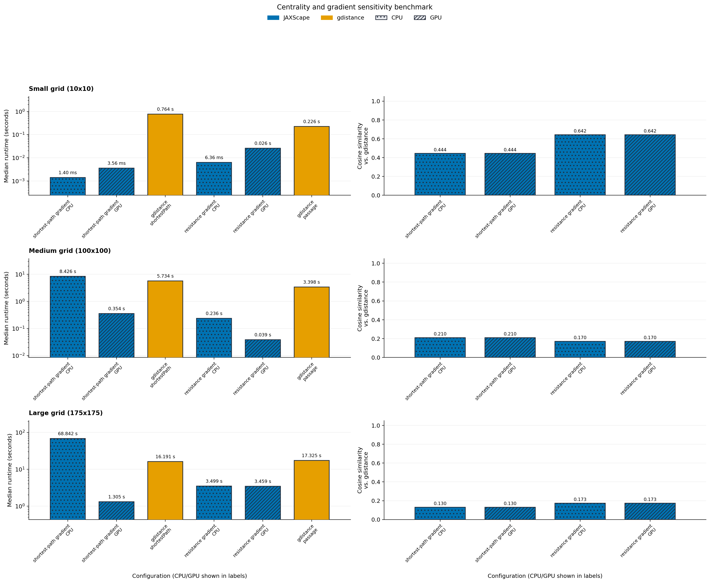
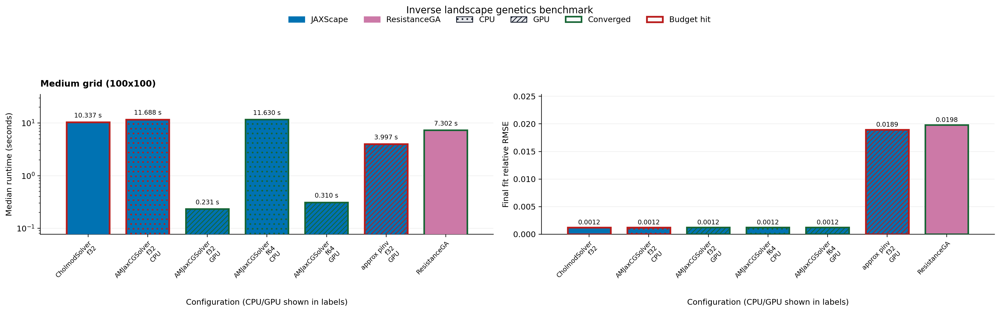

<!-- Generated from docs/benchmark.template.md by benchmark/generate_benchmark_docs.py. -->

# Benchmark

JAXScape ships with a benchmark workspace that keeps benchmark inputs synthetic and reproducible, records the exact runtime context used for each published artifact, and renders the benchmark page from shared metadata plus the latest benchmark result JSON.

!!! tip "Observed Best JAXScape Configurations"
    - Resistance distance: `JAXScape / AMJaxCGSolver / f64 (GPU)` is the fastest successful JAXScape configuration on `synthetic_resistance_large` at 0.331 s, about 42.24x faster than the matching CPU run.
    - Least-cost path: no successful JAXScape run is available for `synthetic_lcp_large` in the current artifact.
    - Centrality and gradient sensitivity: `JAXScape / shortest-path gradient (GPU)` is the fastest successful JAXScape configuration on `synthetic_sensitivity_large` at 1.305 s, about 52.76x faster than the matching CPU run.
    - Inverse landscape genetics: `JAXScape / AMJaxCGSolver / f32 (GPU)` is the fastest successful JAXScape configuration on `synthetic_inverse_medium` at 0.231 s, final MSE 4.96e+05, converged=True, about 50.52x faster than the matching CPU run.

## Environment snapshot

| Setting | Value |
| --- | --- |
| Requested device | `gpu` |
| Available JAX platforms | `gpu` |
| Repeats | `3` |
| Benchmark threads | `4` |
| CPU device | `CpuDevice(id=0)` |
| GPU device | `CudaDevice(id=0)` |
| Thread environment | `BENCHMARK_THREADS=4, OMP_NUM_THREADS=4, OPENBLAS_NUM_THREADS=4, MKL_NUM_THREADS=4, VECLIB_MAXIMUM_THREADS=4, NUMEXPR_NUM_THREADS=4, JULIA_NUM_THREADS=4, RCPP_PARALLEL_NUM_THREADS=4, RCPPTHREAD_NUM_THREADS=4, XLA_FLAGS=--xla_cpu_multi_thread_eigen=true intra_op_parallelism_threads=4` |

## Compatibility summary

| Feature | Published benchmark coverage | Notes |
| --- | --- | --- |
| Resistance distance | `JAXScape`, `gdistance`, `Circuitscape.jl` | The published `gdistance` series is rescaled from commute time to effective resistance by dividing by graph volume. |
| Least-cost path | `JAXScape`, `gdistance` | The published comparison uses the same grid-graph least-cost task in JAXScape and `gdistance`. |
| Centrality and gradient sensitivity | `JAXScape`, `gdistance` | The chart compares single-origin JAXScape gradients against the matching single-origin `gdistance::shortestPath` incidence and `gdistance::passage(..., totalNet = "total")` references on the same origin/destination set. |
| Inverse landscape genetics | `JAXScape`, `ResistanceGA` | Runtime, convergence status, and final fit quality are reported together; the published fit-quality chart uses relative RMSE because raw inverse MSE is not directly comparable across the current tool-specific objective scales. |

## Fairness policy

All automated runs use deterministic synthetic landscapes on 4-neighbour grid graphs and report median runtimes from the repeat count recorded in each benchmark artifact. Resistance, least-cost, and sensitivity tasks share the same raster-to-graph parameterization, the same site-sampling policy, and the same published thread budget across Python, Julia, and R. The sensitivity benchmark uses a task-specific large grid because exact reverse-mode centrality objectives have much higher memory growth than distance-matrix queries; the large sensitivity case records one timed repeat, while smaller cases use the suite repeat count. The environment snapshot above is rendered directly from the benchmark artifact so the documented runtime context tracks the actual run rather than a hand-maintained description.

Cross-software comparisons are only published when the task definition is close enough to interpret. For resistance distance, the `gdistance` series is rescaled from commute time to effective resistance by dividing by graph volume. For inverse landscape genetics, runtime and fit quality are reported together so budget-limited or non-converged runs remain visible.

## Resistance distance

Formal problem: given an undirected grid graph $G = (V, E)$ with conductance weights $w_{ij}$ and a sampled node set $S \subset V$, compute the pairwise effective resistance matrix $R_{uv}$ for all $u, v \in S$.

Published benchmark coverage:

`JAXScape`, `gdistance`, `Circuitscape.jl`

<div align="center"></div>

## Least-cost path

Formal problem: given the same grid graph and sampled node set $S$, compute the pairwise shortest-path distance matrix $D_{uv}$ for all $u, v \in S$ under edge costs $r_{ij} = \frac{c_i + c_j}{2}$.

Published benchmark coverage:

`JAXScape`, `gdistance`

<div align="center"></div>

## Sensitivity analysis

The sensitivity benchmark differentiates scalar connectivity objectives with respect to raster entries, then compares the resulting JAXScape gradient surfaces to matched single-origin `gdistance` references on the same origin/destination set and shared cost surface. The shortest-path side uses summed `gdistance::shortestPath` incidence rasters, while the resistance side uses summed `gdistance::passage(..., totalNet = "total")` rasters. The scorecard reports runtime together with cosine similarity against the reference surface.

Published benchmark coverage:

`JAXScape`, `gdistance`

<div align="center"></div>

## Inverse landscape genetics

Formal problem: infer a raster-valued resistance or permeability field parameter $\theta$ by minimizing a discrepancy between observed pairwise dissimilarities $y$ and model-predicted pairwise distances $f_\theta(S)$. The benchmark reports runtime together with the final objective MSE,

$$
\mathrm{MSE} = \frac{1}{n} \sum_i (f_\theta(S)_i - y_i)^2.
$$

Published benchmark coverage:

`JAXScape`, `ResistanceGA`

The published inverse benchmark aligns JAXScape and ResistanceGA around the same base-surface task. JAXScape optimizes a differentiable monomolecular transform of the base resistance surface derived from the synthetic raster, using two learnable parameters that mirror ResistanceGA's `select.trans = list("M")` setup. AMJax profiles build one preconditioner from that initial transformed graph and then reuse it while JAXScape refreshes CG state against each current operator.

<div align="center"></div>

## Regenerate locally

```bash
uv sync --extra benchmark --extra amjax --extra cholespy
./benchmark/install_external_tools.sh
./benchmark/run_benchmarks.sh --device cpu --require-complete
```

The wrapper keeps the aggregate suite in the canonical benchmark artifact path, regenerates the scorecards, and refreshes this markdown page from the shared registry and the current result JSON.

For local GPU profiling, keep the same workflow and switch the device hint:

```bash
./benchmark/run_benchmarks.sh --device gpu
```

To regenerate the page from an existing benchmark artifact without rerunning the suite:

```bash
uv run python benchmark/generate_benchmark_docs.py
```

To run a representative smoke check before a long benchmark launch:

```bash
./benchmark/run_smoke_checks.sh
```