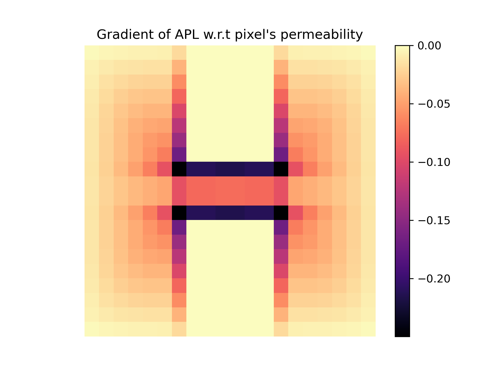

# Quick Start

This tutorial will walk you through the basics of using JAXScape for connectivity analysis.

## Creating a Graph

JAXScape works with grid-based graphs where each pixel represents a node. Let's start by creating a simple graph from a permeability raster:

```python
import jax.numpy as jnp
from jaxscape import GridGraph
import numpy as np
import matplotlib.pyplot as plt

# Load permeability data
permeability = jnp.array(np.loadtxt("permeability.csv", delimiter=","))

# Visualize the permeability
plt.imshow(permeability, cmap="gray")
plt.axis("off")
plt.show()

# Create a grid graph
grid = GridGraph(grid=permeability)
```

The `GridGraph` class automatically constructs a graph where each pixel is connected to its neighbors. The edge weights are determined by the permeability values.

## Computing Distances

JAXScape provides several distance metrics. Let's compute distances from the top-left pixel to all other pixels:

```python
from jaxscape import ResistanceDistance, LCPDistance, RSPDistance

# Get the index of the top-left pixel
source = grid.coord_to_index(jnp.array([0]), jnp.array([0]))

# Define distance metrics
distances = {
    "LCP distance": LCPDistance(),
    "Resistance distance": ResistanceDistance(),
    "RSP distance": RSPDistance(theta=0.01, cost=lambda x: 1 / x)
}

# Compute and visualize distances
fig, axs = plt.subplots(1, 3, figsize=(10, 4))
for ax, (title, distance) in zip(axs, distances.items()):
    dist_to_node = distance(grid, sources=source)
    cbar = ax.imshow(grid.node_values_to_array(dist_to_node.ravel()), cmap="magma")
    ax.axis("off")
    ax.set_title(title)
    fig.colorbar(cbar, ax=ax, shrink=0.2)

fig.suptitle("Distance to top left pixel")
plt.tight_layout()
plt.show()
```

<div align="center">
  
</div>

## Automatic Differentiation

You can compute gradients of distance metrics with respect to the landscape parameters:

```python
import equinox as eqx
import jax

# Define an objective function
@eqx.filter_jit
def average_path_length(permeability, distance):
    grid = GridGraph(grid=permeability)
    dist = distance(grid)
    return dist.sum() / (grid.nv ** 2)

# Compute gradient
grad_connectivity = jax.grad(average_path_length)
distance = LCPDistance()

# Calculate sensitivities
sensitivities = grad_connectivity(permeability, distance)

# Visualize
plt.figure()
plt.imshow(sensitivities, cmap="magma")
plt.title("Gradient of APL w.r.t pixel's permeability")
plt.colorbar()
plt.show()
```

<div align="center">
  
</div>

This gradient shows how each pixel's permeability affects the average path length across the entire landscape.


## Computing Subset Distances

You can compute distances between specific sets of nodes:

```python
# Define sources and targets
sources = jnp.array([0, 10, 20])  # Node indices
targets = jnp.array([50, 60, 70])

# Compute distances from sources to targets
distance = LCPDistance()
dist_matrix = distance(grid, sources=sources, targets=targets)
# Result shape: (len(sources), len(targets))

# Compute distances among a set of nodes
nodes = jnp.array([0, 10, 20, 30])
dist_matrix = distance(grid, nodes=nodes)
# Result shape: (len(nodes), len(nodes))
```